# 🐧 TCP Penguin

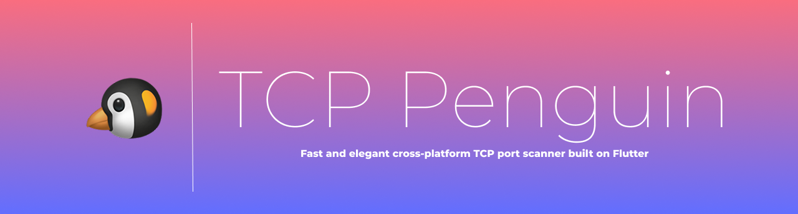

## 1. Описание

**TCP Penguin** – кроссплатформенный (Android, iOS) TCP-сканнер, который умеет сканировать порты и показывать / сохранять открытые порты выбранного домена.

**TCP-сканер** — это инструмент, который проверяет, какие порты на удалённом хосте открыты (то есть принимают соединения по протоколу TCP).

Сканер помогает увидеть, какие порты торчат наружу, и закрыть лишние.

### 1.1. Назначение и функции

У проекта есть два основных назначение:
1. Создание удобного инструмента для сканирования портов
1. Показать мой скилл Flutter-разработки для поиска работы, так как я перехожу из нативной Anroid-разработки во Flutter

Основные функции:
1. Сканирование портов TCP.
1. Регулировать: хост, диапазон портов, количество одновременных воркеров.
1. Сохранение успешно найденных портов в базу, а также удаление.
1. Выгрузка в CSV-файл всех сохранённых портов.

Дополнительные фишки:
1. Локализация на два языка: EN, RU
1. Подсветка ошибок при неверном вводе данных, также блокируется кнопка "Сканировать", пока данные введены неверно.
1. Прогресс-бар, который реагирует на прогресс сканирования.
1. RichText в диалоге "О приложении".
1. Цикличная анимаиця диалога "О приложении" с эффектом 3D.
1. Покрытие тестами.

## 2. Превью

### 2.1. Скринкасты

#### 2.1.1. Флоу сканирования


#### 2.1.2. Флоу ошибок при вводе данных

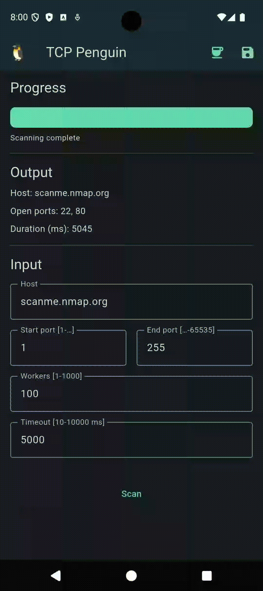

#### 2.1.3. Флоу сохранения результата сканирования

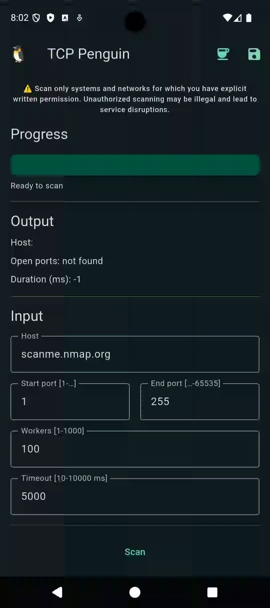

#### 2.1.4. Флоу выгрузки результатов сканирования


#### 2.1.5. Флоу диалогового окна доната

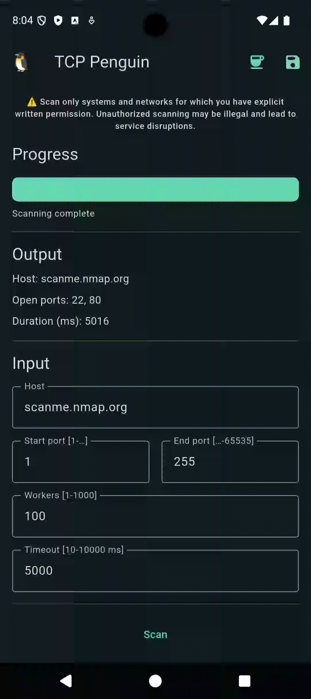

#### 2.1.6. Флоу диалогового окна пингвина


### 2.2. Скриншоты

#### 2.2.1. Скриншоты платформ: Android / iOS

| Android | iOS |
| ---- | ---- |
| 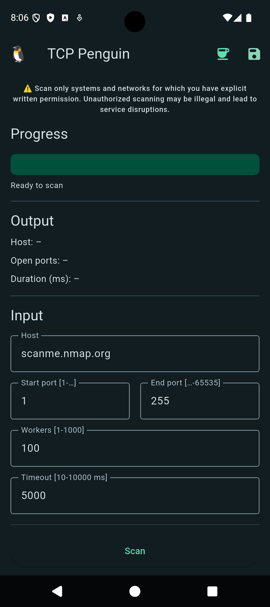 | 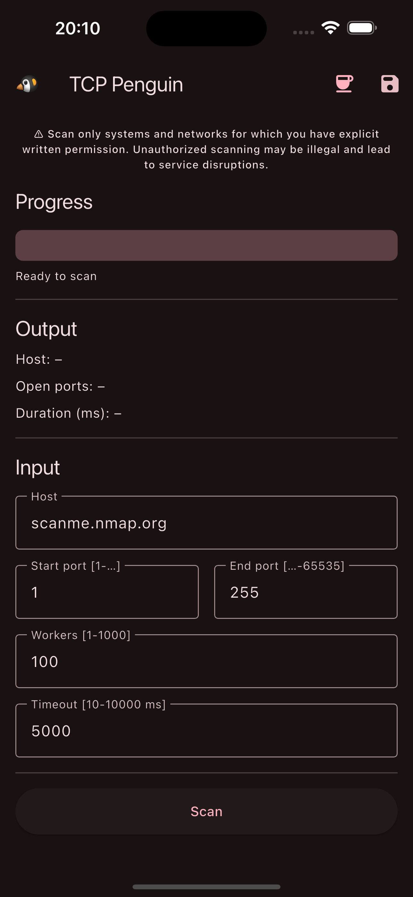 | 

#### 2.2.2. Скриншоты основных экранов: Гланый экран / Сохранённые сканирования / Диалоги

| Home | Saved scans | Donation | About |
| ---- | ---- | ---- | ---- |
| 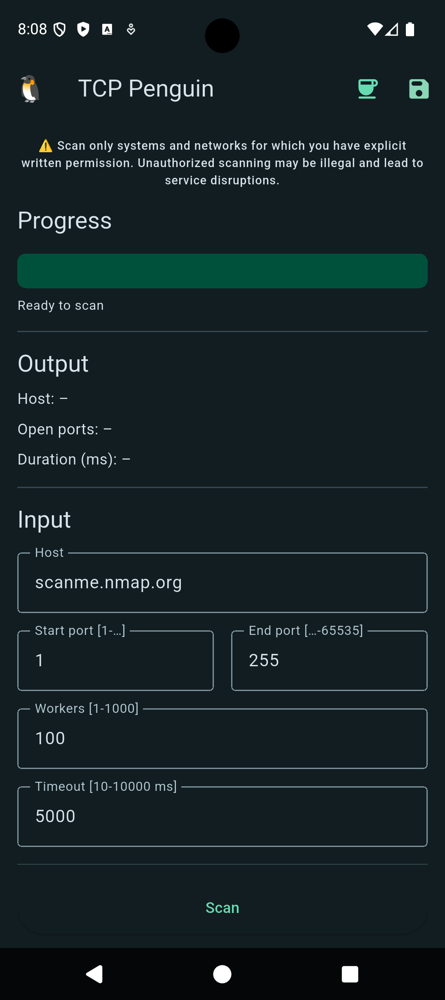 | 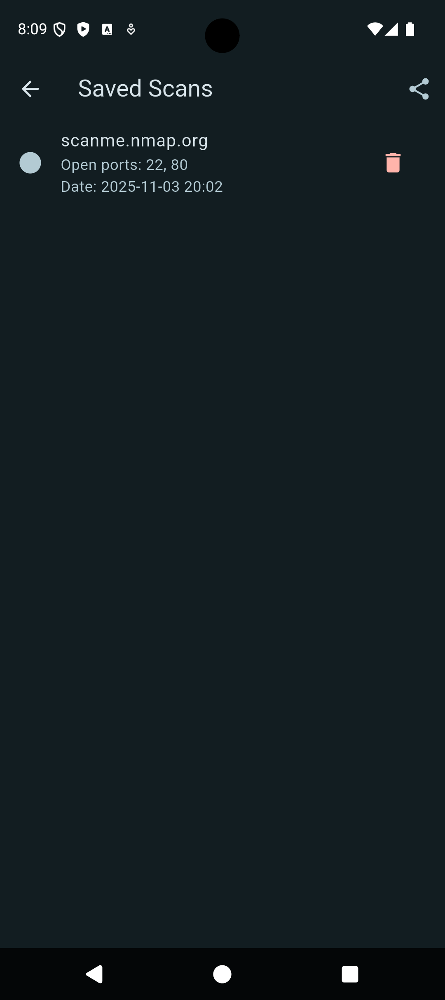 | 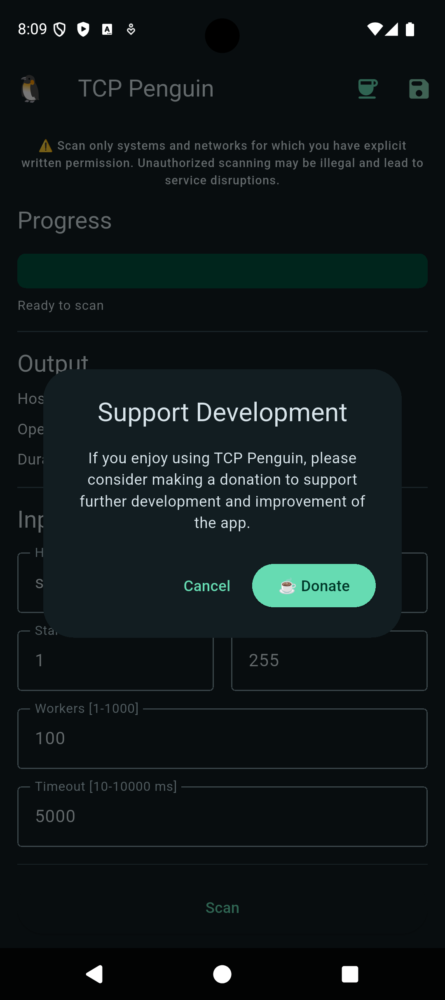 | 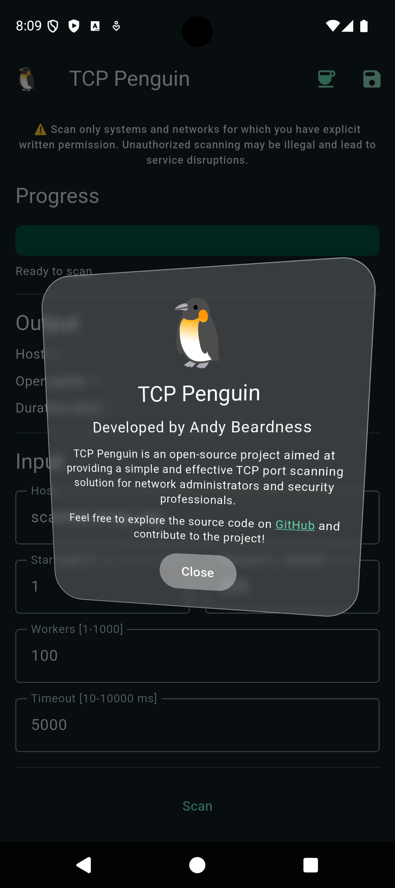 |

#### 2.2.3. Скриншоты темы: Светлая / Тёмная

| Light | Dark |
| ---- | ---- |
| 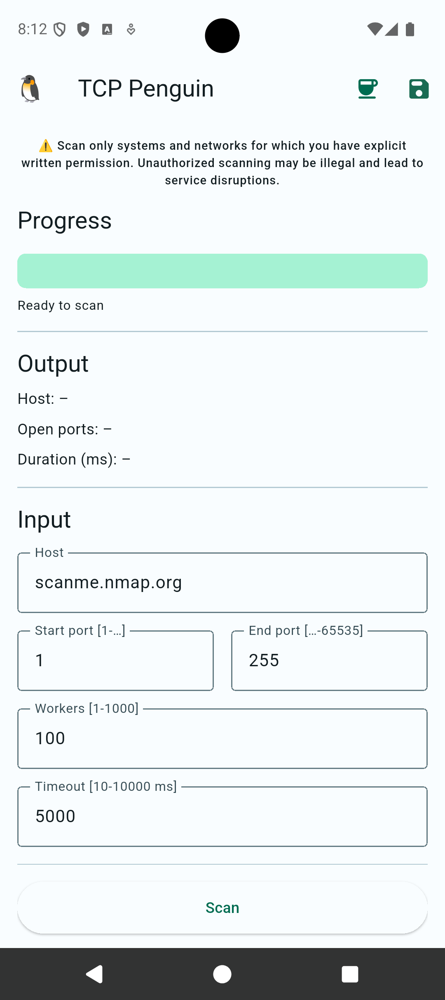 | 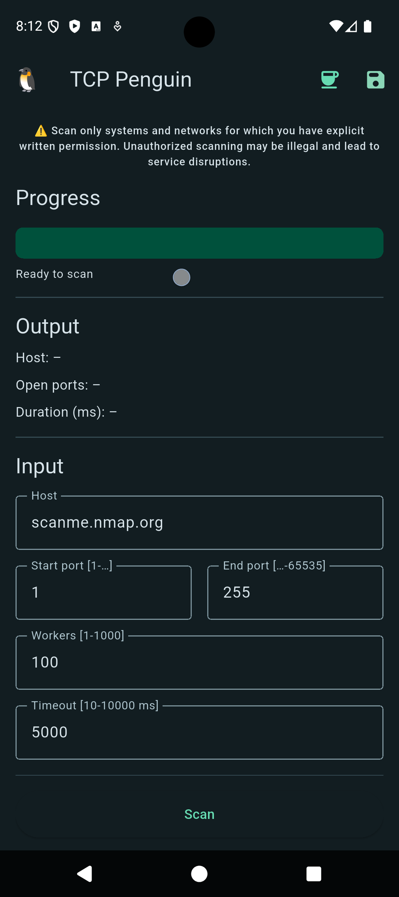 | 

#### 2.2.4. Скриншоты динамических тем Android

| Orange | Purple | Red | Pink |
| ---- | ---- | ---- | ---- |
| 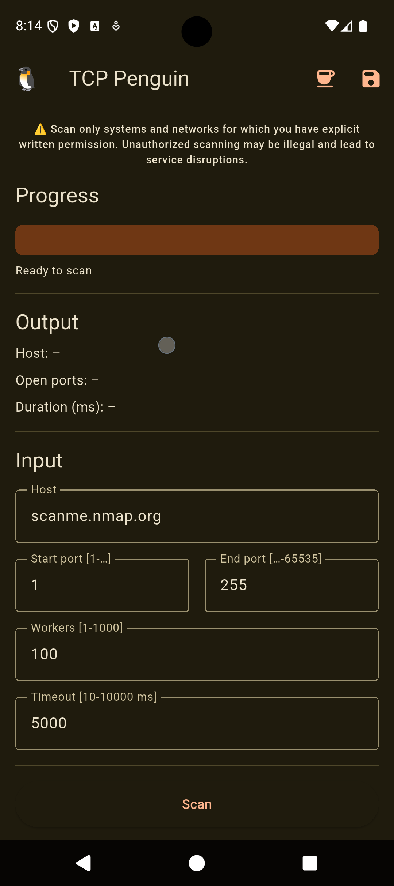 | 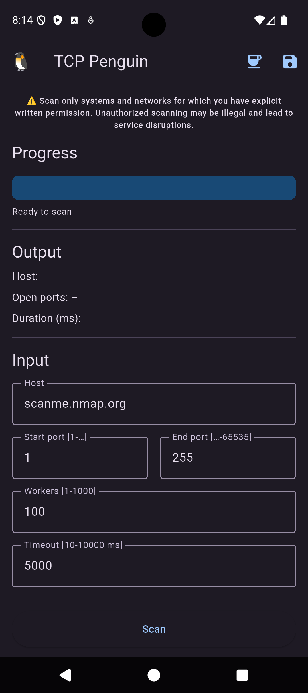 | 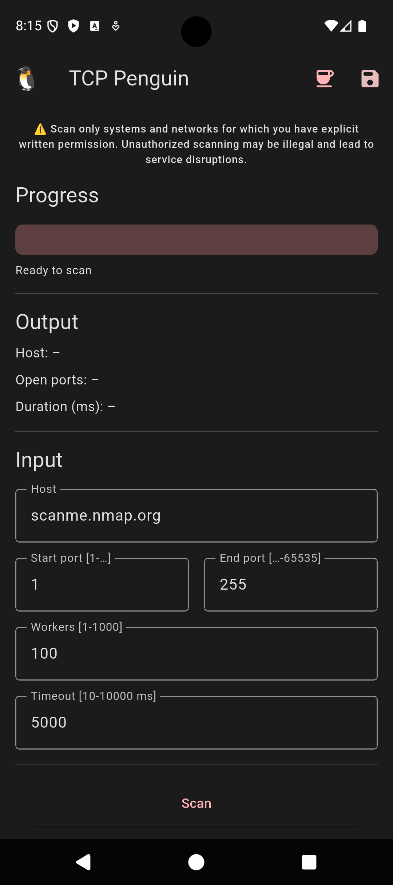 | 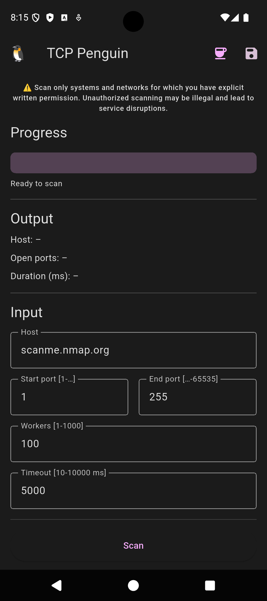 |

## 3. Код

В основе кодовой базы лежат принципы чистой архитектуры.

### 3.1. Архитектура

Основные разделы кода:
1. `/app` – раздел приложения – DI, навигация, локализация
1. `/data` – дата-слой – база данных и репозитории
1. `/domain` – доменный-слой – промежуточные классы с обособленной логикой
1. `/presentation` – презентации-слой – экраны, общие view, утилиты 

### 3.2. Инъекция зависимостей

Реализовал через пакет `get_it`

Инъекции каждого слоя разделены для простоты поддержки

Все зависимости аккумулируются через единую функцию 
```dart
Future<void> setupDI() async {...}
```

Инъекция происходит на старте приложения

```dart
Future<void> main() async {
  WidgetsFlutterBinding.ensureInitialized();
  await setupDI();

  runApp(const MyApp());
}
```

### 3.3. Навигация

Навигация реализовал через пакет `go_router`

Есть вспомогательный класс для поддержки анимации переходов между экранами

```dart
class TransitionPage<T> extends CustomTransitionPage<T> {
  TransitionPage({required super.key, required super.child})
    : super(
        transitionDuration: const Duration(milliseconds: 300),
        reverseTransitionDuration: const Duration(milliseconds: 300),
        transitionsBuilder: (context, animation, secondaryAnimation, child) {
          return SlideTransition(
            position: Tween<Offset>(begin: const Offset(1, 0), end: Offset.zero)
                .animate(
                  CurvedAnimation(
                    parent: animation,
                    curve: Curves.easeInOut,
                    reverseCurve: Curves.easeInOut,
                  ),
                ),
            child: child,
          );
        },
      );
}
```

### 3.4. Локализация

Локализация основна на подходе из пакета `gen_l10n`

Но вместо него, я реализовал такие же классы сам, так как редактирование `.arb` достаточно ограничено и не позволяет разделять на логические блоки

Я реализовал те же классы сам, но разделил переводы строк на подклассы по каждому экрану

Приложение поддерживает локали `EN` и `RU`

#### 3.4.1. Дата-слой

Тут я организовал работу с базой данных и репозиториями

##### 3.4.1.1. База данных

В качестве базы данных использую пакет `isar`

В проекте используется один HostEntity
```dart
@collection
class HostEntity {
  Id id = Isar.autoIncrement; // ID
  late String host;           // Сохранённый хост
  late List<int> openPorts;   // Открытые порты хоста
  late DateTime createdAt;    // Дата создания
}
```

##### 3.4.1.2. Репозиторий

В дата-слое есть инстанс репозитория `HostRepository`

Репозиторий содержит методы **Create**, **Update**, **Delete**

Реализация **Read** происходит через поток, на который можно подписаться, чтобы всегда иметь поток актуальных данных

```dart
class HostRepository {
  final Isar isar;

  BehaviorSubject<List<HostEntity>> hosts = BehaviorSubject.seeded([]);

  HostRepository({required this.isar}) {
    isar.hostEntitys.watchLazy(fireImmediately: true).listen((_) async {
      final savedHosts = await isar.hostEntitys.where().findAll();
      hosts.add(savedHosts);
    });
  }
```

#### 3.4.2. Домен-слой

Содержит вспомогательные промежуточные классы, которые аккумулируют логику

Вынесение логики в доменный слой помогает поддерживать тестирумость проекта

Основные доменные классы:
1. `tcp_scanner` – обёртка над `Socket` из пакета `dart:io`
1. `concurency_tcp_scanner` – использует `tcp_scanner` для создания множества воркеров и параллельного сканирования портов
1. `host_saver` – инкапсулирует логику сохранения / обновления сканирования
1. `scans_sharer` – инкапсулирует логику сохранения / шаринга csv-файла со всеми сохранёнными сканированиями

#### 3.4.3. Презентейшн-слой

В приложении есть два экрана:
1. Экран сканирования (домашний)
2. Экран сохранённых сканов

Также есть два диалоговых окна:
1. Диалог с информацией о приложении и разработчике и ссылкой на этот репозиторий
1. Диалог с предложением доната разработчику с ссылкой на сервис ko-fi

##### 3.4.3.1. Блок

В качестве управления состоянием использую пакет `bloc`

На каждом экране реализованы сущности
```dart
// Bloc
class HomeScreenBloc extends Bloc<HomeScreenBlocEvent, HomeScreenBlocState> {...}

// BlocState
class HomeScreenBlocState extends Equatable {...}

// BlocEvent
sealed class HomeScreenBlocEvent {...}

// BlocEffect
sealed class HomeScreenBlocEffect {...}
```

##### 3.4.3.2. Вёрстка

Экран делится на две сущности

```dart
// HomeScreen – Обёртка BlocProvider
class HomeScreen extends StatelessWidget {
  const HomeScreen({super.key});

  @override
  Widget build(BuildContext context) {
    return BlocProvider(
      create: (_) => getIt<HomeScreenBloc>()..add(HomeScreenBlocEventInitial()),
      child: const HomeScreenBody(),
    );
  }
}

// HomeScreenBody – Тело экрана
class HomeScreenBody extends StatefulWidget {...}
class _HomeScreenBodyState extends State<HomeScreenBody> {...}
```

Изменяемые элементы обёрнуты в BlocSelector

```dart
BlocSelector<HomeScreenBloc, HomeScreenBlocState, double>(
    selector: (s) => s.progress,
    builder: (context, progress) {
    return TweenAnimationBuilder<double>(
        tween: Tween<double>(begin: 0, end: progress),
        duration: Duration(milliseconds: 200),
        curve: Curves.easeInOut,
        builder: (context, value, child) {
        return LinearProgressIndicator(
            value: value,
            minHeight: 32,
            borderRadius: BorderRadius.circular(8),
        );
        },
    );
    },
),
```

##### 3.4.3.2. Утилиты

Есть одна утилита для форматирования дат, которая используется в presentation-слое

```dart
class DateFormatter {
  static final DateFormat _dateFormat = DateFormat('yyyy-MM-dd HH:mm');

  static String format(DateTime dateTime) {
    return _dateFormat.format(dateTime);
  }
}
```

### 3.5. Тесты

Тестами покрыты утилиты presentation-слоя и сушности domain-слоя

Примеры:

```dart
// date formatter tests
void main() {
  group('DateFormatter', () {
    test('Format my birthday', () {
      final dt = DateTime.utc(2025, 5, 8, 18, 50);
      final formatted = DateFormatter.format(dt);
      expect(formatted, '2025-05-08 18:50');
    });

    ...
  });
}
```

Использование моков в тестах

```dart
// Мок репозитория
class _HostRepositoryMock extends Mock implements HostRepository {}

// Мок сущности сохарённого хоста
class _HostEntityFake implements HostEntity {}

void main() {
  late HostRepository hostRepository;
  late BehaviorSubject<List<HostEntity>> hostsSubject;
  late HostSaver hostSaver;

  setUp(() {
    hostRepository = _HostRepositoryMock();
    hostsSubject = BehaviorSubject<List<HostEntity>>.seeded(<HostEntity>[]);
    hostSaver = HostSaver(hostRepository: hostRepository);

    when(() => hostRepository.hosts).thenAnswer((_) => hostsSubject);

    when(
      () => hostRepository.saveHost(
        host: any(named: 'host'),
        openPorts: any(named: 'openPorts'),
        createdAt: any(named: 'createdAt'),
      ),
    ).thenAnswer((_) async {});

    when(
      () => hostRepository.updateHost(
        host: any(named: 'host'),
        openPorts: any(named: 'openPorts'),
      ),
    ).thenAnswer((_) async {});
  });

  tearDown(() async {
    await hostsSubject.close();
  });

  // Пример теста
  test('Regular host saved', () async {
    final host = 'example.com';
    final openPorts = [20, 85];
    final createdAt = DateTime.utc(2025, 1, 1, 1, 1, 1);

    await hostSaver.saveHost(
      host: host,
      openPorts: openPorts,
      createdAt: createdAt,
    );

    verify(
      () => hostRepository.saveHost(
        host: host,
        openPorts: openPorts,
        createdAt: createdAt,
      ),
    ).called(1);

    verifyNever(
      () => hostRepository.updateHost(
        host: any(named: 'host'),
        openPorts: any(named: 'openPorts'),
      ),
    );
  });

  ...
}
```

## 4. Дополнительно

Есть лицензия [MIT](LICENSE)

Есть [страница релизов](https://github.com/andybeardness/TCP-Penguin-Flutter/releases)