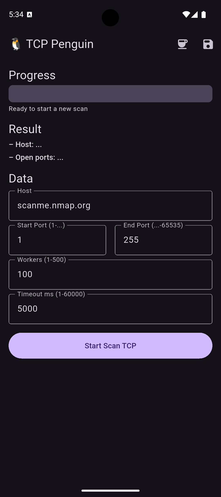
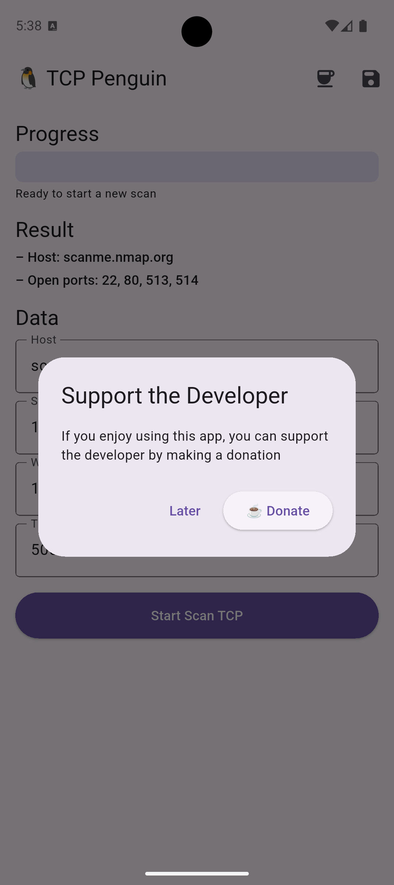

# 🐧 TCP Penguin


**TCP Penguin** is a fast and elegant **cross-platform TCP port scanner** built on **Flutter**, powered by **Isar** for local persistence and **RxDart** for reactive architecture.  
Designed for engineers who value performance, simplicity, and full ecosystem portability.

---

## 🚀 Why TCP Penguin?

✅ High-performance concurrent scanning  
✅ Smart resolution of open TCP ports  
✅ Persistent history storage using Isar Database  
✅ Real-time reactive UI driven by streams  
✅ Android / iOS support  
✅ Clean modular architecture with DI (GetIt)  
✅ Built for both developers and network engineers  

> *Zero bloat. Pure speed.*

---

## 📱 Screenshots

|  |  |  | 
| ---- | ---- | ---- | ---- |

---

## 🧩 Tech Stack

| Area | Technology |
|------|------------|
| Framework | Flutter 3.35+ |
| State / Streams | RxDart |
| Local DB | Isar |
| Navigation | GoRouter |
| Dependency Injection | GetIt |
| Async Execution | ConcurrencyRunner |
| Min Android | API 24+ |
| Min iOS | 13.0 |

---

## 📦 Run the App

```bash
git clone https://github.com/andybeardness/tcp_penguin.git
cd tcp_penguin
flutter pub get
flutter run
```

⚠️ Permissions to add manually:
- **Android:** `INTERNET` in `AndroidManifest.xml`
- **iOS:** `NSLocalNetworkUsageDescription` in `Info.plist`

---

## 📐 Architecture Overview

TCP Penguin follows **Clean Architecture** principles:

```
lib/
 ├─ app/           # App bootstrap and navigation
 ├─ data/          # Repos, models, database sources
 ├─ domain/        # Core business rules and use cases
 ├─ presentation/  # UI, widgets, view models
 └─ di/            # All dependency registration modules
```

Key highlights:
- **Feature-first** structure
- **Reactive flow**: Domain → Presentation
- **Low coupling** and **high testability**

---

## 🔐 Usage Ethics

> **You are responsible for your scans.**  
> Use TCP Penguin **only** on networks where you have explicit authorization.  
> Unauthorized network probing may violate cybersecurity laws.

---

## 💬 Author

**Andy Beardness**  
Android / Flutter / Rust Engineer  

---

## ⭐ Support the Project

If this tool helped you — star the repo ❤️  
It keeps the penguin happy.

🐧✨
