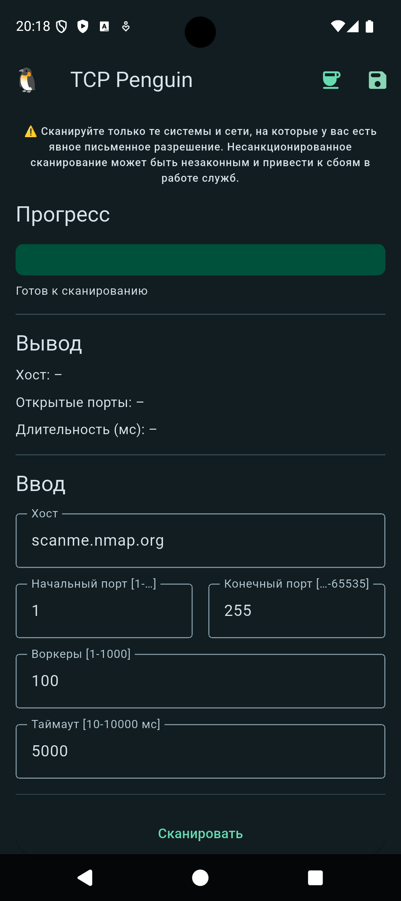

# 🐧 TCP Penguin


## 1. Description

**TCP Penguin** is a cross-platform (Android, iOS) TCP scanner that can scan ports and display/save open ports of a selected domain.

**TCP Scanner** is a tool that checks which ports on a remote host are open (i.e., accepting TCP connections).

The scanner helps identify which ports are exposed and close unnecessary ones.

### 1.1. Purpose and Features

The project has two main purposes:
1. To create a convenient tool for port scanning.
2. To showcase my Flutter development skills to find a job, as I’m transitioning from native Android development to Flutter.

Main features:
1. TCP port scanning.
2. Adjustable host, port range, and number of concurrent workers.
3. Saving successfully found ports to a database and allowing deletion.
4. Exporting all saved ports to a CSV file.

Extra features:
1. Localization in two languages: EN, RU.
2. Input validation with error highlighting; the "Scan" button is disabled until all inputs are valid.
3. Progress bar reacting to scan progress.
4. RichText in the "About" dialog.
5. Cyclic 3D-like animation in the "About" dialog.
6. Unit test coverage.

## 2. Preview

### 2.1. Screencasts

#### 2.1.1. Scanning Flow


#### 2.1.2. Input Error Flow


#### 2.1.3. Scan Result Saving Flow


#### 2.1.4. CSV Export Flow


#### 2.1.5. Donation Dialog Flow


#### 2.1.6. Penguin Dialog Flow


### 2.2. Screenshots

#### 2.2.1. Platforms: Android / iOS

| Android | iOS |
| ---- | ---- |
|  |  | 

#### 2.2.2. Main Screens: Home / Saved Scans / Dialogs

| Home | Saved scans | Donation | About |
| ---- | ---- | ---- | ---- |
|  |  |  |  |

#### 2.2.3. Themes: Light / Dark

| Light | Dark |
| ---- | ---- |
|  |  | 

#### 2.2.4. Dynamic Android Themes

| Orange | Purple | Red | Pink |
| ---- | ---- | ---- | ---- |
|  |  |  |  |

#### 2.2.5. Localization Screenshots

| En | Ru |
| ---- | ---- |
|  |  | 

## 3. Code

The codebase is built on clean architecture principles.

### 3.1. Architecture

Main code sections:
1. `/app` – application layer: DI, navigation, localization
2. `/data` – data layer: database and repositories
3. `/domain` – domain layer: intermediate logic classes
4. `/presentation` – presentation layer: screens, shared views, utilities 

### 3.2. Dependency Injection

Implemented using the `get_it` package.

Each layer has its own injection for easier maintenance.

All dependencies are registered through a single function:
```dart
Future<void> setupDI() async {...}
```

Injection occurs at app startup:
```dart
Future<void> main() async {
  WidgetsFlutterBinding.ensureInitialized();
  await setupDI();

  runApp(const MyApp());
}
```

### 3.3. Navigation

Navigation is implemented using the `go_router` package.

A helper class supports screen transition animations:
```dart
class TransitionPage<T> extends CustomTransitionPage<T> {
  TransitionPage({required super.key, required super.child})
    : super(
        transitionDuration: const Duration(milliseconds: 300),
        reverseTransitionDuration: const Duration(milliseconds: 300),
        transitionsBuilder: (context, animation, secondaryAnimation, child) {
          return SlideTransition(
            position: Tween<Offset>(begin: const Offset(1, 0), end: Offset.zero)
                .animate(
                  CurvedAnimation(
                    parent: animation,
                    curve: Curves.easeInOut,
                    reverseCurve: Curves.easeInOut,
                  ),
                ),
            child: child,
          );
        },
      );
}
```

### 3.4. Localization

Localization is based on the `gen_l10n` approach.

However, instead of using `.arb` files, I implemented equivalent custom classes, since `.arb` editing is too limited and doesn’t allow splitting strings into logical blocks.

I divided string translations into subclasses per screen.

The app supports `EN` and `RU` locales.

#### 3.4.1. Data Layer

Handles database and repository logic.

##### 3.4.1.1. Database

Using the `isar` package as the database.

The project defines one entity `HostEntity`:
```dart
@collection
class HostEntity {
  Id id = Isar.autoIncrement; // ID
  late String host;           // Saved host
  late List<int> openPorts;   // Open ports of the host
  late DateTime createdAt;    // Creation date
}
```

##### 3.4.1.2. Repository

In the data layer there is a `HostRepository` instance.

The repository contains **Create**, **Update**, **Delete** methods.

**Read** is implemented via a stream that allows real-time data updates:
```dart
class HostRepository {
  final Isar isar;

  BehaviorSubject<List<HostEntity>> hosts = BehaviorSubject.seeded([]);

  HostRepository({required this.isar}) {
    isar.hostEntitys.watchLazy(fireImmediately: true).listen((_) async {
      final savedHosts = await isar.hostEntitys.where().findAll();
      hosts.add(savedHosts);
    });
  }
```

#### 3.4.2. Domain Layer

Contains helper classes that encapsulate business logic.

Extracting logic into the domain layer improves testability.

Main domain classes:
1. `tcp_scanner` – wrapper over `Socket` from `dart:io`
2. `concurency_tcp_scanner` – creates multiple workers for parallel scanning
3. `host_saver` – encapsulates save/update logic
4. `scans_sharer` – encapsulates logic for saving/sharing a CSV file with scans

#### 3.4.3. Presentation Layer

The app includes two screens:
1. Scanning screen (home)
2. Saved scans screen

And two dialogs:
1. About app and developer info (with link to repo)
2. Donation dialog (link to Ko-fi)

##### 3.4.3.1. Bloc

State management uses the `bloc` package.

Each screen defines:
```dart
class HomeScreenBloc extends Bloc<HomeScreenBlocEvent, HomeScreenBlocState> {...}
class HomeScreenBlocState extends Equatable {...}
sealed class HomeScreenBlocEvent {...}
sealed class HomeScreenBlocEffect {...}
```

##### 3.4.3.2. Layout

Screen is split into:
```dart
class HomeScreen extends StatelessWidget { ... }
class HomeScreenBody extends StatefulWidget {...}
```

Dynamic parts are wrapped with `BlocSelector`:
```dart
BlocSelector<HomeScreenBloc, HomeScreenBlocState, double>(
    selector: (s) => s.progress,
    builder: (context, progress) {
    return TweenAnimationBuilder<double>(
        tween: Tween<double>(begin: 0, end: progress),
        duration: Duration(milliseconds: 200),
        curve: Curves.easeInOut,
        builder: (context, value, child) {
        return LinearProgressIndicator(
            value: value,
            minHeight: 32,
            borderRadius: BorderRadius.circular(8),
        );
        },
    );
    },
),
```

##### 3.4.3.3. Utilities

Utility for date formatting used in the presentation layer:
```dart
class DateFormatter {
  static final DateFormat _dateFormat = DateFormat('yyyy-MM-dd HH:mm');

  static String format(DateTime dateTime) {
    return _dateFormat.format(dateTime);
  }
}
```

### 3.5. Tests

Tests cover utilities (presentation layer) and entities (domain layer).

Example:
```dart
void main() {
  group('DateFormatter', () {
    test('Format my birthday', () {
      final dt = DateTime.utc(2025, 5, 8, 18, 50);
      final formatted = DateFormatter.format(dt);
      expect(formatted, '2025-05-08 18:50');
    });
  });
}
```

Mocks are used for testing:
```dart
class _HostRepositoryMock extends Mock implements HostRepository {}
class _HostEntityFake implements HostEntity {}
```

## 4. Additional

License: [MIT](LICENSE)

Releases: [GitHub Releases](https://github.com/andybeardness/TCP-Penguin-Flutter/releases)
